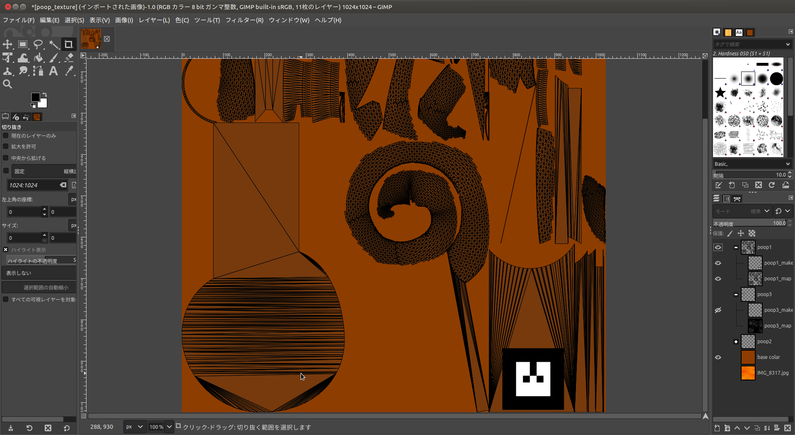
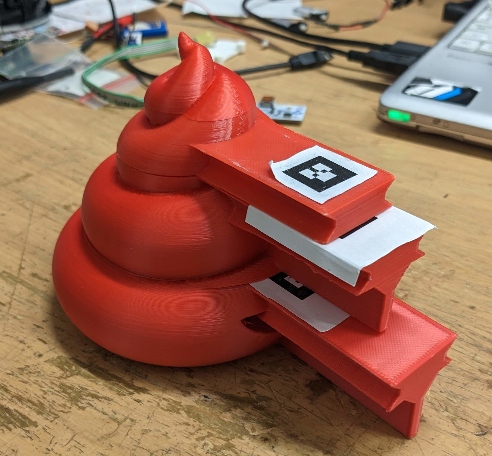
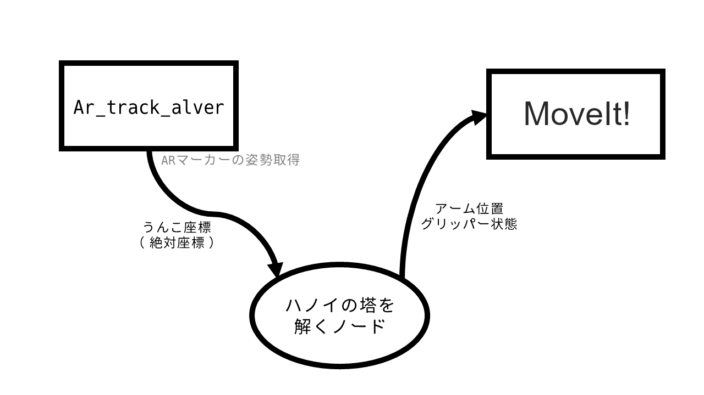
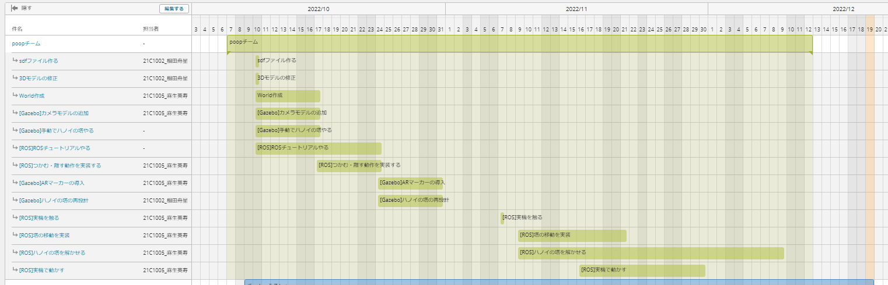

<section data-background="bg.png">

## 設計製作論3 最終発表

poop班

2022/12/19

麻生英寿　相田舟星

---

#### 目次

- デモ
  - デモ説明
  - 動画
- アピールポイント
  - うんこ
  - ARマーカー
- 達成度
- 総括
  - パッケージ
  - メンバー
  - スケジュール
- 反省

---

# デモ

---

## デモ説明

**う〇こ(2段)を移し替えます**

 

ハノイの塔のルール
- 3箇所のトイレと2種類のうんこがある
- 小うんこの上に大うんこは乗せられない
- 一度に動かせるのは1うんこまで

---

## 動画

#### https://twitter.com/tukugami_cola/status/1603314567282454528

---

## アピールポイント

---

## うんこ

かわいさとうんこさを両立したモデル

### Pile of Poo Emoji (U+1F4A9)

- 既存の3Dモデルに取っ手を追加
- 綺麗に重ねるために突起とくぼみも追加
- gazebo用にマーカー付きモデルを新規作成

---

---

## ARマーカー

ARマーカーによってうんこの配置を自由にした

### ar_track_alvar

- http://wiki.ros.org/ar_track_alvar
- ARマーカー検出用パッケージ
- カメラ補正やマーカー出力にも対応

---

## 達成度

# 85%

#### (60%以上で合格)

- ○:ハノイの塔が解けた
- ○:マーカーを使って配置を自由にした
- ×:うんこが3段から2段に減った

---

# 総括

---

## パッケージ

---

### メンバー

## 麻生英寿

- やったこと:プログラミング

- タスク
  - ノード作成
  - launch,worldファイル作成
  - リポジトリ管理

---

### メンバー

## 相田舟星

- やったこと:モデリング

- タスク
  - うんこ設計
  - 3Dプリント
  - Gazebo用モデル作成

---

## スケジュール

---

## 反省

- ノードの完成が遅れた
  - ARマーカーの動確で満足してしまった
  - プログラム担当が急用で一日休んだ
- 重ねる動作が不安定
  - 実機で調整する時間がなかった
  - 経路生成が適当だった
- スケジュールが適当
  - やったことリストと化した
  - 後半はまともに見てなかった
- ベトナムの人に失礼

---

## 展望

- 動作確認で満足しない
- 一度動いただけで満足しない
- よく話し合ってスケジュールを決める